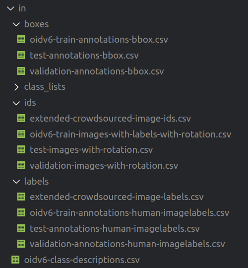
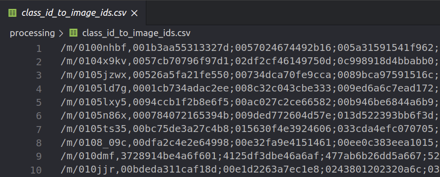
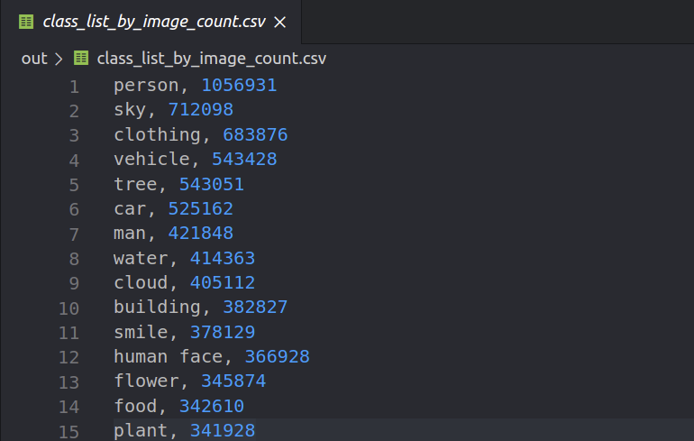
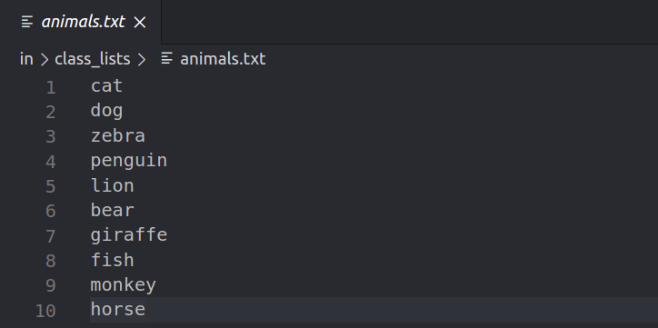
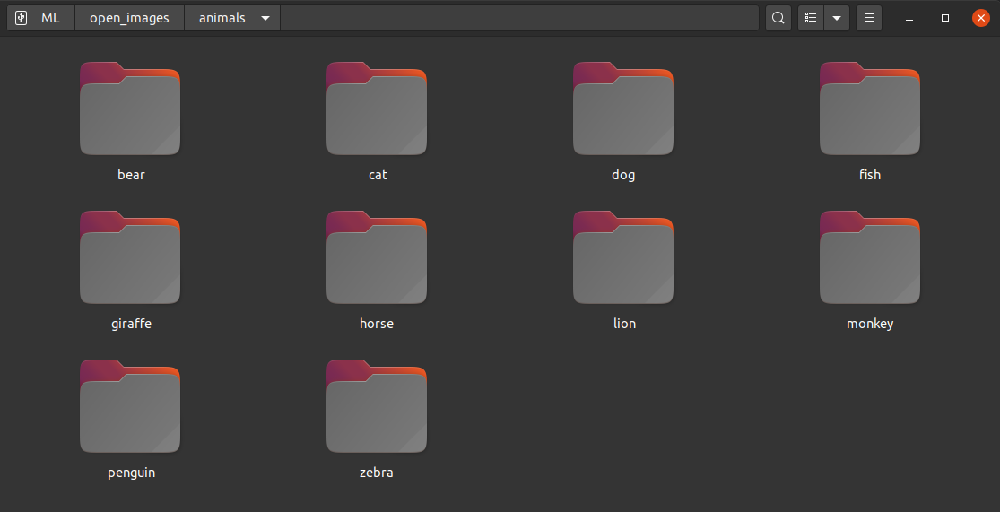
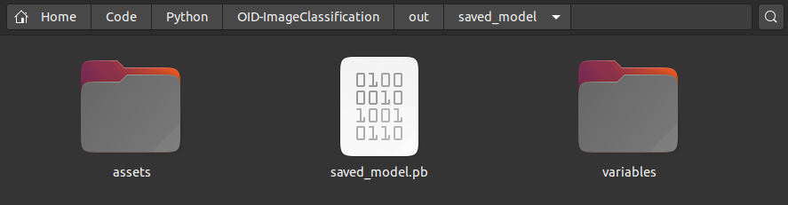
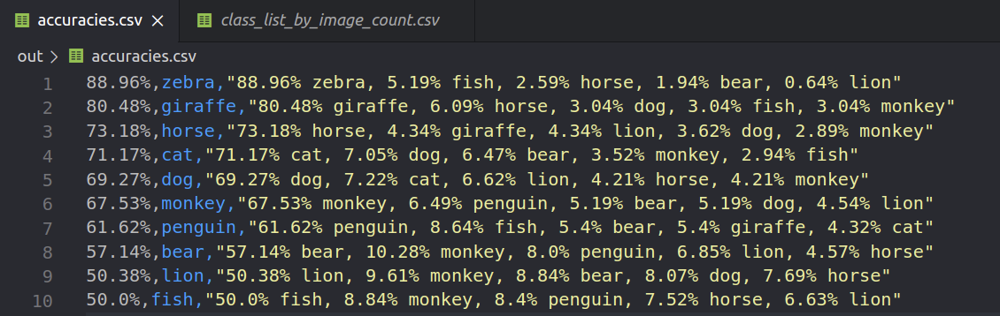

  <h1>Open Images - Image Classification</h1>
  

    
    
  

  
A collection of scripts to download data, train and evaluate  an image classifier on Open Images using TensorFlow

## Table of Contents
- [Features](#features)
- [Dependencies](#dependencies)
- [Usage](#usage)
- [Recommendations](#recommendations)
- [License](#license)

## Features
 - Create a list of all classes by image count
 - Download images for custom lists of classes (using parallelization)
 - Delete corrupt images
 - Train a model of choice on the downloaded image dataset
 - Evaluate the performance of the model (includes per-class accuracies)
 
## Dependencies
 Python 3.6 or higher
 
 | Package | Version
| -------- | ----------- |
`Pillow` | `7.0.0` |
`numpy` | `1.18.5` |
`requests` | `2.22.0` |
`tensorflow` | `2.3.1` |
`tensorflow-hub` | `0.9.0` |
`sklearn` | `0.23.2` |
                
Other package versions may work too.  
Can be installed from requirements.txt

## Usage
1. Download the **Image IDs**, **Image labels**, **Boxes** and **Class Names** from https://storage.googleapis.com/openimages/web/download.html  
 (Train, Validation and Test of "Subset with Image-Level Labels" and Bounding Boxes of "Subset with Bounding Boxes")
 
2. Put them in a folder structure like this:

	
	
4. Create folders named **out** and **processing**

5. Run the script **1_create_class_id_to_image_ids.py**  
	*Output:*  
	
	
6. Run the script **2_create_class_list_by_image_count.py**  
	*Output:*  
	
	
7. Choose class names to train your classifier on from **out/class_list_by_image_count** and put them into a **.txt** file inside **in/class_lists**  
*Example*:  

8. Adjust all options in **config.py** under **# image download** to your liking

9. Run the script **3_download_images.py**  
	*Example Output:*  
	
	
10. Run the script **4_delete_corrupt_images.py**

11. Adjust all options in **config.py** under **# model training** to your liking

12. Run the script **5_train_model.py**  
	*Output:*  
	  
	Now you have an Tensorflow Image classifier at **out/saved_model**
	
13. If you killed the previous script because it took too long,
run **6_extract_model_from_checkpoint.py**

14. Run the script **7_evaluate_model.py**  
	*Output:*  
	
	
15. DONE

## Recommendations
 - The dataset is very noisy, you might have to manually delete images that do not fit the label
 - Make sure you have enabled GPU support https://www.tensorflow.org/install/gpu
 - Place your dataset on a SSD drive (500Mb/s should be enough) for faster training

## License
This project is distributed under the MIT License - see the [LICENSE](LICENSE) file for details
